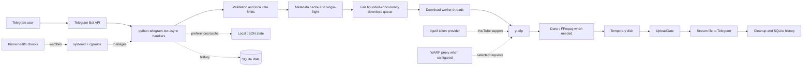

# All-Media Downloader Bot

A self-hosted Telegram bot that guides a user through choosing a media mode and quality, downloads supported public media with `yt-dlp`, processes it with FFmpeg when needed, and sends the result back to the requesting chat. `yt-dlp` supports many sites; availability depends on each site's current behavior and access controls.

The project is a small, single-node production application, not a distributed download platform. Its stable v1 reference is tag [`v1.0.0`](https://github.com/gazzy-source/all-media-downloader/releases/tag/v1.0.0), commit `830f351113669d6637e76de2fe3cd701f7078e7d`.

## Architecture at a glance



## Engineering features

- Async Telegram handlers with blocking extraction/download work isolated in thread pools.
- A fair download queue, per-user concurrency limits, process-local request limits, and a separate `UploadGate` for upload slots and in-flight byte budgeting.
- Metadata request coalescing (single-flight), bounded metadata/search caches, and Telegram `file_id` reuse where eligible.
- Downloads land in per-job temporary directories; Telegram uploads stream from disk rather than loading the whole file into Python memory.
- SQLite WAL for history; small local JSON files for preferences, caches, counters and best-effort interruption markers.
- `yt-dlp`, optional Deno/YouTube token support, FFmpeg, and optional proxy routing remain external dependencies.
- Production runs as a systemd service with cgroup limits and is monitored with Kuma. Operational details are in [Operations](docs/OPERATIONS.md).

The production VM is constrained (about 952 MiB RAM and two shared vCPUs in the October 2026 snapshot); CPU steal and swap activity vary. The Telegram upload ceiling also constrains the largest send. Those facts inform conservative concurrency and resource limits; see [Architecture](docs/ARCHITECTURE.md) and [Decisions](docs/DECISIONS.md).

## Local setup

Requirements: Python 3.11 or later, a Telegram bot token, and FFmpeg for formats that need media merging or conversion. Deno and the bgutil provider are optional and relevant to selected YouTube extraction paths.

```powershell
py -3.11 -m venv .venv
.\.venv\Scripts\Activate.ps1
python -m pip install -r requirements.txt
Copy-Item .env.example .env
# Edit .env and set BOT_TOKEN (and optional ADMIN_IDS / integrations).
python run.py
```

On Linux/macOS, use `python3 -m venv .venv`, activate with `source .venv/bin/activate`, and copy `.env.example` to `.env`. Keep tokens and cookies out of source control. Local Docker setup is described in [Deployment](docs/DEPLOYMENT.md); production operations are documented separately.

## Tests

```bash
python -m pip install -r requirements-dev.txt
python -m pytest -p no:cacheprovider tests/
```

For a focused regression, pass its test file or node to pytest. CI also runs static/import checks and the supported Python-version matrix; see [CONTRIBUTING.md](CONTRIBUTING.md).

## Documentation

- [Architecture](docs/ARCHITECTURE.md): request flow, concurrency, state, limits and scaling triggers.
- [Decisions](docs/DECISIONS.md): engineering trade-offs and evidence.
- [Operations](docs/OPERATIONS.md): production topology, deploy, rollback and verification.
- [Song audio](docs/SONG_AUDIO.md): conservative music classification, source preservation and Telegram/cache tradeoffs.
- [Deployment](docs/DEPLOYMENT.md): local and Docker setup.
- [Health checks](docs/HEALTH.md): health endpoint behavior.
- [Cookie handling](docs/COOKIES.md): optional credential handling.
- [Agent guidance](AGENTS.md): repository rules for coding agents.\n
