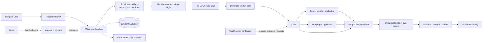

# v1 architecture

This describes the single-node v1 application at the `v1.0.0` / `830f351` checkpoint. Code is authoritative when implementation and prose differ. Production sizing below is a timestamped VM snapshot from 2026-10-03 UTC, not a promise that the VM still has those values.

## System overview

The bot process is the orchestrator. Docker sidecars in production include Kuma and the bgutil token provider; the bot itself is a host systemd service. WARP is a host service used for selected outbound traffic when configured. Local Docker Compose also supports a containerized bot for development/self-hosting; that is not the production topology.

## Request lifecycle

1. PTB receives a Telegram update and dispatches an async handler. The handler validates the URL/input, checks process-local rate limits and user/session state, and rejects unsupported or unsafe destinations.
2. Metadata is requested from a bounded cache. Concurrent requests for the same normalized URL share one in-flight extraction; blocking yt-dlp extraction runs in a metadata thread pool. Format information drives the mode/quality wizard.
3. When the user confirms, a job enters the fair `DownloadQueue`. Admission respects global queue/worker limits and per-user active-job limits. The queue prioritizes premium work while applying user fairness; it is in-memory and does not survive a process restart.
4. A worker runs blocking yt-dlp work in a thread, writing into a per-job `temp/dl_<id>/` directory. yt-dlp may invoke Deno or FFmpeg child processes for supported extraction, merging, audio conversion, or subtitles. Progress hooks update the Telegram message.
5. Once the result is ready, the download worker releases its slot. `UploadGate` then admits an upload by slot and byte budget. PTB sends a file handle with streaming enabled (`read_file_handle=False`), so the whole file is not copied into Python memory. Eligible repeat sends can use a cached Telegram `file_id`.
6. Success/failure is reported to the user, eligible metadata/history/cache state is updated, and the per-job directory is removed. Cleanup also periodically removes stale temporary files.

## Concurrency and resource bounds

| Control | Current behavior |
|---|---|
| Event loop | One asyncio event loop runs PTB handlers and async coordination. Blocking extraction/download work is offloaded to threads. |
| PTB request pool | HTTP connection pool size 16; PTB concurrent update handling is enabled. |
| DownloadQueue / workers | Production setting `MAX_CONCURRENT_DOWNLOADS=3`; code default is 5. Queue is in-memory; download work uses a `ThreadPoolExecutor` sized from the configured concurrency plus two threads. |
| Per-user | At most 2 active downloads per user in current configuration; rate limiting is process-local and configurable (production snapshot: 40 requests/hour; admins bypass). Premium users receive the configured multiplier. |
| Metadata/search | Metadata executor has 4 workers; search has its own 3-worker executor. These isolate blocking work from the event loop. |
| UploadGate | Defaults to 2 simultaneous uploads and a 100 MiB in-flight byte budget. A file larger than the remaining budget can run alone, bounded by the gate's admission logic. The slot is held over upload retries. |
| Media bounds | Production final-file ceiling is 49 MB. Code defaults also cap download bytes at 3× the final limit, duration at 3 hours, an overall download deadline at 15 minutes, and metadata extraction at 45 seconds. Environment overrides may change these. |

`DownloadManager` also has an internal semaphore as a defensive cap; it is not a second queue. The worker threads do not make yt-dlp CPU parallel in every stage: many operations are network or subprocess work, and child-process cost remains bounded mostly by the number of admitted jobs and systemd cgroups. FFmpeg and Deno are child processes, not Python process-pool tasks.

## State and persistence

- **SQLite**: `data/history.sqlite3` stores history and related counters using WAL mode and indexes. Earlier JSON history is imported by current migration logic; SQLite is the active history store.
- **Local JSON**: `data/userprefs.json` stores user preferences; `data/url_tokens.json` stores bounded local counters/tokens; `data/inline_cache.json` stores eligible Telegram `file_id` results (bounded to about 3,000 entries); `data/inflight.json` is a bounded best-effort interruption marker file. Heartbeat state is also written locally.
- **In memory**: active jobs, queue contents, sessions, rate-limit state, metadata/search caches, and single-flight coordination are process-local and lost on restart.
- **Temporary files**: downloads and per-job cookie copies live below the working tree's temporary/data paths and are cleaned after use or by the stale-file cleanup task.

The interruption marker can help notify a user that a process stopped during a request. It is not a durable job record, checkpoint, retry log, or recovery queue. Job execution is **not resumable durable distributed execution**. A restart can interrupt an active download or upload; delivery is not exactly once.

## Caches and coalescing

- Metadata cache: bounded at 64 entries, with a 180-second TTL. Metadata single-flight shares one extraction result among concurrent requests for the same URL.
- Search cache: bounded at 300 entries with a 900-second TTL; search also coalesces concurrent identical work.
- Download reuse metadata has a 1,800-second TTL where applicable.
- Telegram `file_id` cache is local and bounded by entry count (about 3,000); it avoids re-uploading eligible media. It is not a general media object store.

Single-flight prevents duplicate concurrent work; a cache may serve a later request. They solve different time windows.

## Cancellation, retries and failures

Queued jobs can be withdrawn. Active cancellation is cooperative: download hooks/socket reads check cancellation, but a blocking native call, `curl_cffi` operation, or FFmpeg child may not stop immediately. A cancelled asyncio await does not guarantee its worker thread or child process stopped at that instant. Deadlines and systemd's stop timeout provide outer bounds, not resumability. Once an upload request is underway, cancellation is limited.

Upload retries distinguish transient transport errors and Telegram `RetryAfter` from permanent rejections. Eligible media-format `BadRequest` cases can fall back to a document; unrelated permanent errors propagate. Retry count, backoff and timeout handling are implemented in the current send path; avoid changing them without focused regression tests. See tests around `_send_media_once` / `_send_media` before touching this behavior.

## Deployment and resource constraints

Production snapshot verified 2026-10-03 UTC:

| Resource/control | Observed value |
|---|---|
| VM | Oracle Cloud free-tier instance, 2 shared vCPUs, about 952 MiB RAM |
| Swap | About 2 GiB enabled; swappiness 10; zswap disabled in that snapshot |
| Bot service | `all-media-downloader.service`, host systemd, service user `mediabot` |
| Bot cgroup | `MemoryHigh=480 MiB`, `MemoryMax=600 MiB`, `CPUQuota=1.8 CPU`, `TasksMax=128`, 60-second stop timeout; private tmp, protected home/system, no new privileges |
| Containers | Kuma limited to 0.5 CPU, 150 MiB memory and 300 MiB memory+swap; bgutil provider also runs as a container |
| Auxiliary services | Host WARP service when configured; health endpoint checked by Kuma |

Values can change in the cloud console, systemd drop-ins, Compose, or environment. Re-read live config before using these numbers as current operational evidence. The VM had variable CPU steal; observed changes in steal confound the 24-hour before/after comparison.

The Telegram Bot API's upload size ceiling is a product constraint; the app uses a 49 MB final-size guard to leave room below the commonly applicable 50 MB bot upload ceiling. A local Bot API server would change the operational boundary and is not part of v1.

## Observed performance context

**[M]** In a 24-hour post-change comparison, mean CPU busy was 5.53% vs 4.14%, mean CPU steal 2.63% vs 1.98%, available memory 346 MB vs 449 MB, swap-in 22.82 vs 10.46 pages/s, and swap-out 17.71 vs 7.57 pages/s (historical baseline vs trial). Disk reads, disk utilization, memory PSI and I/O PSI were also lower; successful YouTube warm-up median/p95 were 4.8/34.0 seconds vs 3.9/7.1 seconds. This was a bundled infrastructure/application state comparison with changing CPU steal, not a controlled causal attribution. User-job samples were too small to prove a user-facing latency improvement. The result did not justify more worker processes, a distributed queue, or enabling zswap.

The run also found substantial major-fault activity at Kuma; the container had previously recorded memory-limit events and CPU throttling. These observations informed a Kuma resource/cadence review but do not imply the bot itself hit an OOM or its configured memory/CPU limits during the measurement.

## Scaling path

- **Current traffic**: retain one bot process, local SQLite/JSON state, in-memory fair queue, bounded thread pools and disk-backed streaming. This matches the measured low utilization and VM constraints.
- **10×**: first measure queue wait, job duration, cgroup memory/CPU events, PSI, disk headroom, Telegram/API errors and upstream throttling. A larger VM or a cautious limit adjustment may be sufficient if the single node is demonstrably saturated. Preserve limits until safe headroom is measured.
- **100×**: if one adequately sized node cannot meet measured throughput/availability targets, make job state and storage semantics explicit before adding workers. Likely work includes durable queueing, shared state, idempotency, storage coordination and controlled webhook/polling topology.
- **1,000×**: multiple workers and distributed coordination/object storage may become appropriate only after the single-node limits and service objectives are quantified. External site rate limits and Telegram upload bandwidth may dominate before Python capacity.

Move to a larger node or higher concurrency when measured admission waits and utilization show a real bottleneck and the proposed change retains RAM, CPU, disk and upstream headroom. Introduce durable/distributed infrastructure only when recovery, multi-node availability or throughput requirements cannot be met by one appropriately sized node.
